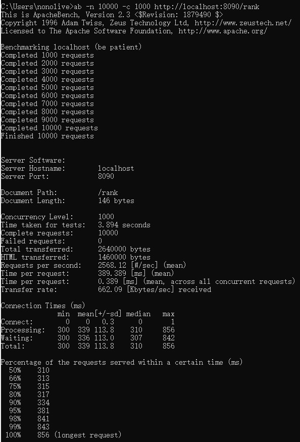

# 启动项目

```shell
go run main.go
```

# 配置文件

在config包下，通过config-<env>.yaml方式指定。默认加载dev文件。  
指定环境启动命令：`go run main.go prod`

# 接口列表

1. http://127.0.0.1:8090/giveGift          送礼接口
2. http://127.0.0.1:8090/rank              排行榜查询接口
3. http://127.0.0.1:8090/giftRecRecordList 收礼流水查询接口

# 排行榜查询接口压力测试

1. 压力值
    - 测试工具：ApacheBench
    - 并发：1000
    - 总请求：10000
    - 请求接口：http://127.0.0.1:8090/rank

2. 测试报告
    - 平均响应时间：389ms
    - QPS：2568/s

3. 报告截图
    - 